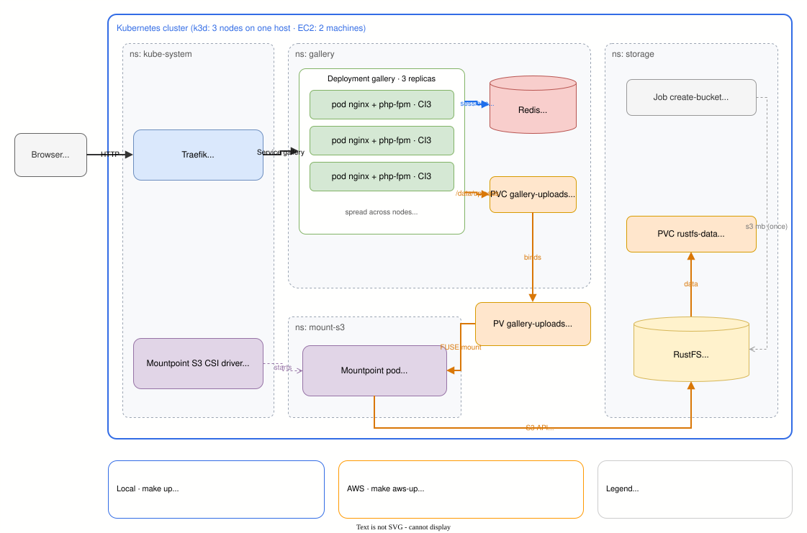

# 01 · Stateless Monolith on Kubernetes

A pattern for making a **stateful** monolith scale horizontally on Kubernetes **without a rewrite**. Sessions move to Redis. Uploaded files move to S3-compatible object storage mounted as a filesystem (FUSE).

The sample app is a deliberately small CodeIgniter 3 photo gallery: log in, upload, browse.

## Problem

Legacy PHP monoliths usually keep two kinds of state on the server's disk:

| State | Default location | What breaks when scaled to many pods |
|---|---|---|
| Login sessions | `sess_driver = 'files'` on local disk | A request routed to another pod logs the user out |
| Uploaded files | local `uploads/` directory | A photo is only visible from the pod that received it |

Sticky sessions or a single replica only postpone the problem. Rewriting file handling against the S3 SDK takes time and touches a lot of code.

## Design



<sub>Editable: open `docs/architecture.drawio.svg` in [draw.io](https://app.diagrams.net) (the diagram source is embedded in the SVG), save, then run `docs/export-diagram.sh` to pin colors for dark-mode viewers.</sub>

| Decision | Why |
|---|---|
| Sessions use CI3's built-in `redis` driver | A config change only; application code is untouched |
| Uploads use the [Mountpoint for Amazon S3](https://github.com/awslabs/mountpoint-s3) CSI driver | Code keeps writing to a local path (`/data/uploads`); the storage behind it is any S3 API |
| [RustFS](https://github.com/rustfs/rustfs) as the S3 endpoint, in-cluster, on both environments | Self-hosted object storage with the same manifests locally and on EC2; MinIO community images are no longer distributed |
| Random file names (`encrypt_name`) | Mountpoint supports neither overwrite nor rename, so every upload must be a new object |
| `/uploads/` served by nginx via `alias`, outside the document root | Uploaded files can never be executed as PHP |
| Session library is not autoloaded | The `/healthz` probe does not create a new Redis session key every few seconds |
| Readiness checks the upload mount, not Redis | If Redis dies, login breaks, but pods do not all go unready at once and take the whole app down |
| `preStop: sleep 5` + `maxUnavailable: 0` | Pods keep serving while the ingress removes them from its endpoints, so rolling updates drop no requests |
| `base_url` from an env var | Otherwise CI3 guesses from `SERVER_ADDR`, and redirects point at the pod IP |
| Framework downloaded at build time with a checksum | The repo holds only application code, not a copy of the framework |
| Storage credentials generated per deployment | Random RustFS keys written to git-ignored env files; the EC2 instance holds no AWS credentials at all |

## Alternatives considered

| Alternative | Why not |
|---|---|
| Sticky sessions at the ingress | Sessions die on pod restart or scale-down; load is uneven |
| `ReadWriteOnce` PVC (EBS) | Can only be mounted on one node |
| EFS / NFS | Full POSIX, a good fit if the app needs rename or append, but costlier per GB and tied to VPC networking |
| s3fs-fuse | More POSIX-like (rename works), but not an AWS project and slower |
| Rewrite file handling with the S3 SDK | Cleanest long term, but it is a rewrite; this pattern exists to avoid one |

## Known limitations

- Mountpoint is built for Amazon S3; RustFS works because it implements the S3 calls Mountpoint uses (ListObjectsV2, GetObject ranges, multipart upload). Moving to Amazon S3 means dropping the endpoint patch and granting the node an IAM role.
- Mountpoint only supports **sequential writes to new files**. In-place edits, appends and renames fail. CI3 uploads still work because `move_uploaded_file()` crosses filesystems (`/tmp` to the mount), so PHP copies the file instead of renaming it.
- CI3 logs, cache and sessions must **never** live on the S3 mount.
- RustFS here is a single instance whose data PVC is pinned to one node (`local-path`). Losing that node makes uploads unavailable until it returns. In production use Amazon S3 or a distributed RustFS deployment.
- Redis here is a single replica without persistence. After a restart users simply log in again. In production use a managed service (ElastiCache) or Redis HA.

## Run locally (no cloud cost)

Requires Docker, [k3d](https://k3d.io), kubectl and helm.

```bash
make up      # 3-node k3d cluster, image build, RustFS (local S3), Redis, Mountpoint CSI, app
make demo    # automated proof, see below
make down    # delete the cluster
```

Open http://localhost:8080 (user `demo`, password `demo`). Every page shows which pod and node served the request.

Mountpoint is pointed at RustFS with `endpoint-url` and `force-path-style` in `k8s/components/rustfs`. RustFS data sits on a `local-path` PVC, so photos survive a RustFS restart.

## Run on AWS

Same image, same manifests, same RustFS component, on two separate EC2 machines: a k3s server and a k3s agent (`agent_count` in Terraform). Only the base URL and the (random) credentials differ from the local run.

```bash
make aws-plan   # Terraform plan; SSH, k3s API and HTTP restricted to your current IP
make aws-up     # apply the plan, join the agent, import the image into every node, deploy, install the CSI driver
                # the generated demo password is in k8s/overlays/aws/secret.env
make aws-demo   # same proof script against the EC2 public IP
make aws-stop   # pause: stop every instance, keep the disks (EBS only)
make aws-start  # resume: new public IPs, kubeconfig and BASE_URL refreshed; the agent rejoins on its own
make aws-down   # destroy everything; RustFS data lives on the server disk and goes with it
```

The agent joins over SSH (`make aws-join`): the k3s token is read from the server and piped through SSH stdin, so it never appears in user_data, Terraform state or a process list. Nodes talk over the VPC private network through a self-referencing security group rule.

EKS is deliberately not used: its control plane alone costs about USD 73 per month. Two t3.small instances with k3s cost about USD 0.06 per hour, so a demo session costs cents.

## Proof

`scripts/demo.sh` logs in once, uploads one photo, hits `/whoami` 12 times with `Connection: close` (so requests spread across pods), then deletes every app pod and checks the session again. It runs unchanged against both environments.

| Run | Nodes | What it proves |
|---|---|---|
| **EC2** (`make aws-demo`) | 2 separate machines | Sessions and files are shared **across hosts**: no shared disk, no shared kernel |
| **Local** (`make demo`) | 3 k3d nodes on one host | Same flow, free and reproducible; nodes are containers, so this alone does not rule out host-level sharing |

A single-node run proves nothing here: on one node even a plain `ReadWriteOnce` volume can be shared by every pod, because RWO means one *node*, not one pod.

### EC2: k3s server + agent on two t3.small instances

```
POD                                NODE                         USER   VISIT  PHOTOS
gallery-5696f687c8-258sw           ip-172-31-19-219             demo   3      4
gallery-5696f687c8-zplsf           ip-172-31-28-196             demo   4      4
gallery-5696f687c8-258sw           ip-172-31-19-219             demo   5      4
gallery-5696f687c8-kcft4           ip-172-31-28-196             demo   6      4
...
unique pods: 3, users seen: demo
== 4. delete all app pods, wait for replacements
{
    "pod": "gallery-5696f687c8-cm4nt",
    "node": "ip-172-31-19-219",
    "user": "demo",
    "login_pod": "gallery-5696f687c8-zplsf",
    "visits": 15,
    "photo_count": 4
}
PASS: sessions and files are consistent across pods
```

- Requests alternate between the server (`ip-172-31-19-219`) and the agent (`ip-172-31-28-196`), yet the user stays `demo` and `visits` keeps climbing: the session lives in Redis, not on either machine.
- The user logged in on a pod on the agent (`login_pod`) and is still logged in on a brand-new pod on the server after every pod was replaced.
- `photo_count` is the same from both machines. Three of those photos were uploaded before the lab was stopped and started again (`make aws-stop` / `aws-start`).

The agent never holds the files. RustFS data is pinned to the server, and the agent's pod reads uploads through its own Mountpoint FUSE mount over the network:

```
$ kubectl get pv <rustfs-data volume> -o jsonpath='{..nodeAffinity..values[0]}'
ip-172-31-19-219                                      # server

$ kubectl -n gallery exec <pod on ip-172-31-28-196> -- df -h /data/uploads
mountpoint-s3             8.0E         0      8.0E   0% /data/uploads

$ ssh <agent> "sudo find / -xdev -name '5881bc71ca9ccde58d010c3921f5f6fa.png' | wc -l"
0                                                     # not on the agent's disk

$ kubectl -n mount-s3 get pods -o wide                # one Mountpoint pod per node, shared by that node's app pods
mp-2v2z6   1/1   Running   ip-172-31-28-196
mp-7s2gw   1/1   Running   ip-172-31-19-219
```

### Local: k3d, 3 nodes on one host

```
POD                                NODE                         USER   VISIT  PHOTOS
gallery-6f5f9f679c-r9lj7           k3d-stateless-gallery-agent-0 demo   3      2
gallery-6f5f9f679c-ddx5b           k3d-stateless-gallery-agent-1 demo   5      2
...
unique pods: 3, users seen: demo
PASS: sessions and files are consistent across pods
```

### Zero-downtime rollout (local)

Hammering `/whoami` for 60 s while `kubectl rollout restart` replaces every pod:

```
without preStop hook:  ok=4179 fail=46
with preStop hook:     ok=5728 fail=0
```

## Layout

```
app/application/      CI3 application code (controllers, views, production config overrides)
docker/               Dockerfile + nginx config for /uploads
k3d/cluster.yaml      local cluster, 1 server + 2 agents
k8s/base/             Redis, Mountpoint PV/PVC, Deployment, Service, Ingress
k8s/components/rustfs/  RustFS, data PVC, bucket job, Mountpoint endpoint patch
k8s/overlays/local/   dummy config and secrets for k3d
k8s/overlays/aws/     config and secrets generated from Terraform outputs (never committed)
terraform/aws/        EC2 k3s server + agent(s), security group pinned to your IP, IMDSv2
scripts/demo.sh       proof script
docs/                 architecture diagram (draw.io, editable SVG) + export script
```
