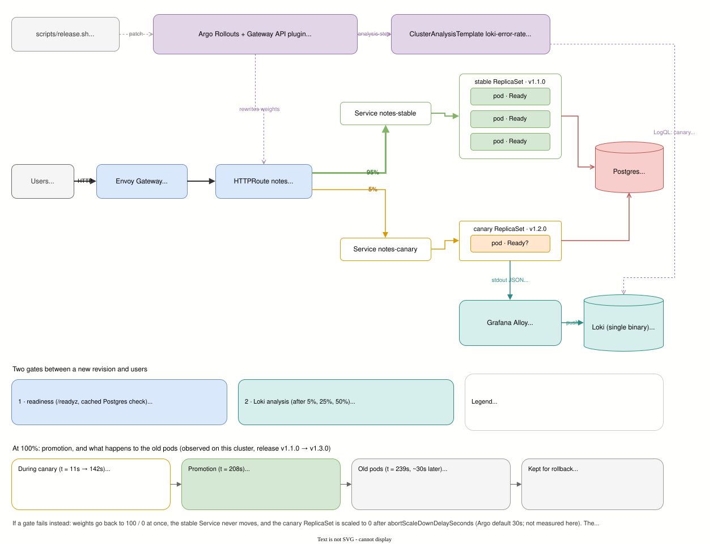

# 02 · Canary Releases Gated by Readiness and Log Analysis

A canary release on Kubernetes: **Envoy Gateway** splits traffic by weight (Gateway API `HTTPRoute`), and **Argo Rollouts** moves the weights step by step. Between a new revision and users there are two gates:

1. **Readiness.** A canary that cannot serve never receives traffic.
2. **Log analysis in Loki.** After each weight step, Argo asks Loki for the canary's error rate, computed from the app's own request logs, before going further.

The point of the showcase is the contract between developers and the platform. An app that follows the [12-factor](https://12factor.net) discipline (config in env, logs as an event stream, disposable processes, honest readiness) can be released, verified and rolled back by the platform **without anyone reading its code**.



<sub>Editable: open `docs/architecture.drawio.svg` in [draw.io](https://app.diagrams.net) (the diagram source is embedded in the SVG), save, then run `docs/export-diagram.sh` to pin colors for dark-mode viewers.</sub>

## Two gates, two kinds of failure

| Gate | Question it answers | Catches | Reaction |
|---|---|---|---|
| **1 · Readiness** (`/readyz`) | Can this pod serve at all? | Bad config, unreachable dependency, crash on start | Canary is never Ready, so it never gets weight. `progressDeadlineAbort` cancels the release after 60 s |
| **2 · Loki analysis** (after 5%, 25%, 50%) | Is it serving users correctly? | A pod that is Ready but broken: logic bugs, error responses on real traffic | Error rate above 2% twice: abort, weights back to 100% stable |

Each gate covers what the other cannot. Readiness keeps a broken canary away from users entirely, but a pod whose dependencies all answer is Ready even if half its responses are 500s. Log analysis sees those 500s, but only after the canary has served some real traffic.

## How the Loki gate works

**The signal is already there.** The app writes one JSON line per request to stdout (12-factor XI):

```json
{"level":"INFO","msg":"request","version":"v1.2.0","method":"GET","route":"GET /api/notes","code":500,"duration_ms":1}
```

**Grafana Alloy** ships pod logs to **Loki** with three stream labels: `namespace`, `app` and `rollouts_pod_template_hash`. The last one comes from the label Argo Rollouts puts on every pod of a revision, and it is what tells canary pods from stable pods.

**Argo asks Loki directly.** Argo Rollouts has no Loki provider, so the analysis uses the generic `web` provider. Loki evaluates the LogQL query and returns a single number. No Prometheus and no recording rules are involved.

```logql
(sum(count_over_time({namespace="notes", app="notes", rollouts_pod_template_hash="<canary-hash>"} | json | msg="request" | code >= 500 [1m])) or vector(0))
/ sum(count_over_time({namespace="notes", app="notes", rollouts_pod_template_hash="<canary-hash>"} | json | msg="request" [1m]))
```

**Platform owns the query, teams pass parameters.** The query lives in one `ClusterAnalysisTemplate` (`k8s/platform/analysis-loki.yaml`). A Rollout in any namespace only passes `namespace`, `app` and `canary-hash`:

```yaml
steps:
  - setWeight: 5
  - analysis: &gate
      templates:
        - {templateName: loki-error-rate, clusterScope: true}
      args:
        - {name: namespace, value: notes}
        - {name: app, value: notes}
        - name: canary-hash
          valueFrom: {podTemplateHashValue: Latest}   # hash of the newest ReplicaSet
  - setWeight: 25
  - analysis: *gate
  - setWeight: 50
  - analysis: *gate
```

Argo does not URL-encode values in the `web` provider's URL, so the query is encoded once by `scripts/gen-loki-analysis.py`. Only the `{{args.*}}` tokens stay raw; they only ever hold plain names and a hash.

**Why `canary-hash` matters.** During a canary, stable and canary pods share `app=notes`. Measured over all of them, the canary's errors are diluted by the stable traffic: a canary failing 26% of its requests at 5% weight is about 26% × 5% ≈ 1.3% of all requests, which would **pass** a 2% threshold. Filtering on the canary's hash measures what the new revision actually does.

**Decision logic per analysis step** (4 measurements, 15 s apart, after a 20 s initial delay):

| Measurement | Counts as |
|---|---|
| error rate ≤ 2% | Successful |
| error rate > 2% | Failed. One is tolerated (`failureLimit: 1`); the second aborts the release |
| Loki unreachable, or no canary logs yet | Error. Two in a row (`consecutiveErrorLimit: 2`) abort the release: no evidence, no promotion |

## Argo Rollouts in this setup

- **`Rollout` replaces `Deployment`** for the app. It owns its ReplicaSets the way a Deployment does, so it also scales them; no other system has to be signalled to scale the old version down. Postgres stays a plain StatefulSet; Argo Rollouts does not manage StatefulSets.
- **Services are roles, not versions.** `notes-stable` and `notes-canary` keep their names. Argo points each one at a revision by adding `rollouts-pod-template-hash` to its selector, so the `HTTPRoute` never changes, only its weights. After promotion, "stable" simply means the new revision and the weights go back to 100/0.
- **What happens at 100%**, recorded with `scripts/watch-promotion.sh` during a v1.1.0 → v1.3.0 release ([full output](docs/promotion-output.txt)):

  ```
      t  phase          weights  stable→      canary→      ReplicaSets (hash ready/desired)
     1s  Healthy        100/0    594f68dfbd   594f68dfbd   594f68dfbd:3/3
    11s  Progressing    95/5     594f68dfbd   678c944578   594f68dfbd:3/3 678c944578:1/1
   142s  Progressing    50/50    594f68dfbd   678c944578   594f68dfbd:3/3 678c944578:2/2
   208s  Progressing    100/0    678c944578   678c944578   594f68dfbd:3/3 678c944578:3/3
   239s  Healthy        100/0    678c944578   678c944578   678c944578:3/3
  ```

  The stable ReplicaSet keeps its full size for the whole canary. At promotion the stable Service's selector moves to the new ReplicaSet, which is already at full size (3/3) in the same sample, and the weights go back to 100/0. The old pods keep running for another ~30 s (`scaleDownDelaySeconds`), so the gateway has stopped using them before they get SIGTERM and drain. The old ReplicaSet object stays at 0 replicas (`revisionHistoryLimit: 3`), so a rollback only scales it up again.
- **The controller edits the `HTTPRoute`** through the Gateway API plugin, which runs inside the controller pod and uses its ServiceAccount. The Helm chart grants that ServiceAccount `get/list/watch/update` on `httproutes` through a **ClusterRole**, so the controller can edit any route in the cluster. On a shared cluster, run it namespace-scoped (`controller.clusterScope=false`) with a Role per namespace instead.
- Only Argo Rollouts is installed. Argo CD, Workflows and Events are separate projects and are not needed here.

## 12-factor: what each factor gives the operator

| Factor | In this app | What it lets the platform do |
|---|---|---|
| I. Codebase | One repo, one image | Every environment runs the same artifact |
| II. Dependencies | `go.mod`, static binary, distroless image (no shell, no package manager) | Small, reproducible image with nothing to patch at runtime |
| III. Config | Every setting is an env var, validated at startup; all problems reported at once; secrets redacted in logs | A config change is a pod template change, so it gets the **same canary and the same gates as a code change** |
| IV. Backing services | Postgres is a URL (`DATABASE_URL`) | Swap the StatefulSet for RDS without a rebuild |
| V. Build, release, run | Version stamped into the binary at build time; `scripts/release.sh` applies image + env as **one** patch | One release = one revision = one canary |
| VI. Processes | No local state; the DB pool is the only thing held in memory | Any pod can be killed or added at any time |
| VII. Port binding | Self-contained HTTP server on `PORT` | No app server or sidecar needed in front |
| VIII. Concurrency | Scale by replicas | The canary is "one more ReplicaSet", nothing special |
| IX. Disposability | On SIGTERM: readiness fails, waits `DRAIN_DELAY`, finishes in-flight requests, exits | Rollouts and scale-downs drop no requests, with no `preStop` hook (and no shell to run one) |
| X. Dev/prod parity | Same image locally (Docker) and on the cluster | What was tested is what runs |
| XI. Logs | One JSON line per request to stdout; probe noise filtered | **The release gate reads them as-is.** Nothing in the app knows about Loki or Argo |
| XII. Admin processes | `notes migrate`: same binary and config, run as a Job before each release, serialized with a Postgres advisory lock | Schema changes are a step in the pipeline, never a side effect of N replicas booting |

Readiness follows the same discipline. Liveness (`/healthz`) only says the process is alive, so a database outage never makes Kubernetes restart every pod. Readiness (`/readyz`) reads a cached result of a background Postgres check with its own timeout, so probes from every replica never multiply into load on the database.

## How a release flows

```bash
scripts/release.sh v1.2.0                     # code release
scripts/release.sh v1.1.0 LOG_LEVEL=debug     # config release (same image)
scripts/release.sh v1.1.0 LOG_LEVEL-          # remove a variable again
```

1. `release_patch.py` builds **one** JSON patch for image + env and prints what changes. Two separate commands would create two revisions back to back.
2. The migrate Job runs with the new image (admin process).
3. The Rollout is patched. Argo creates the canary ReplicaSet and, once it is **Ready**, sets the weights to 5%, runs the Loki analysis, then 25%, analysis, 50%, analysis, then promotes.
4. If the canary is not Ready within 60 s, or an analysis fails, the release aborts and the weights stay on stable.

Manifests are plain YAML applied with `kubectl apply -f`. `k8s/app/20-rollout.yaml` is the initial state only; re-applying it resets the app to v1.0.0.

## Decisions and alternatives tried

| Tried | What happened | Kept? |
|---|---|---|
| Analysis from Prometheus metrics | Works with app metrics per pod hash, but adds Prometheus and `/metrics` instrumentation. Gateway metrics cannot help: Envoy Gateway compiles both weighted `backendRefs` of a rule into **one Envoy cluster**, so they are stable + canary combined | No: the request logs already exist, and many teams already aggregate logs in Loki |
| Loki through recording rules into Prometheus | Valid when many dashboards and alerts share the same series; here it would only add a ruler and remote-write for one consumer | No: Argo queries Loki directly, and only during releases |
| Per-backend Envoy metrics via `routingType: Service` + per-endpoint stats | Load balancing becomes per connection through kube-proxy. Measured spread across 3 pods: 44 / 25 / 21 | No |
| Tiered readiness (green / orange / red: blocking vs tolerable dependencies) with Envoy active health checks | Worked on the cluster, including a degraded-but-serving release. Simplified by choice: readiness answers only "can it serve", and how well it serves is judged from real traffic by the Loki gate | No: binary readiness plus Loki analysis |
| Kustomize (`kubectl apply -k`) with hashed ConfigMaps | Needs extra transformer config for the `Rollout` CRD and overlay workarounds | No: plain `kubectl apply -f`, env in the pod template |
| Replica-count canary (no traffic router) | Weights can only move in steps of one pod | No: weights at the gateway |

## Known limitations

- **The log gate needs traffic.** No requests means no logs, which counts as an error and aborts after two measurements. That is deliberate (fail closed), but a low-traffic service needs a synthetic load or a smoke test (Argo's `job` provider) instead.
- **Each analysis step adds about 80 s** (20 s delay + 4 × 15 s). Three gates make a good release take about 3.5 minutes.
- **A pod that turns not-Ready mid-canary** is removed from the route endpoints, but the abort only comes from the next failing analysis or from the progress deadline. Not measured in this lab.
- Loki keeps 24 h on node-local disk; Postgres is a single instance. Both are lab-sized.
- Envoy Gateway listens on 8080 because Traefik from [01](../01-stateless-monolith/) owns port 80 on the same cluster.

## Run it

Runs on the EC2 k3s cluster provisioned by [01-stateless-monolith](../01-stateless-monolith/) (server + agent, Terraform there). Set `AWS_PROFILE` to your profile.

```bash
make up        # start the nodes (01's workloads are scaled to 0 to free memory), install
               # Envoy Gateway, Argo Rollouts + plugin, Loki, Alloy, the analysis template,
               # then build and deploy notes v1.0.0
make demo      # the four scenarios below (~10 minutes)
make url       # http://<server-ip>:8080/
make dashboard # prints the dashboard URL: http://<server-ip>:8080/rollouts/
make status    # rollout tree and current route weights
make release VERSION=v1.3.0 CONFIG="LOG_LEVEL=debug"
make test      # Go unit tests in a golang:1.27 container
make teardown  # remove 02 from the cluster
make stop      # stop the EC2 nodes (disks kept)
```

## Proof

`make demo` against the two-node EC2 cluster. Full output: [docs/demo-output.txt](docs/demo-output.txt).

| # | Release | Gate that decided | Outcome |
|---|---|---|---|
| 1 | v1.1.0 | Loki: 0.000 error rate at 5%, 25% and 50% | Promoted in 201 s |
| 2 | v1.1.0 with a wrong `DATABASE_URL` | Readiness: `NOT READY (postgres=FAIL)` | Never received weight; aborted at 59 s |
| 3 | Override removed | (identical to stable) | Healthy at once, no canary |
| 4 | v1.2.0 with `FAULT_RATE=0.3` | Readiness passed (`READY`); **Loki** measured 0.263, then 0.273 | Aborted at 5% weight |

**1. Good release: three Loki gates, promoted**

```
     5s  Progressing - more replicas need to be updated   notes-stable=95 notes-canary=5
    67s  Progressing - more replicas need to be updated   notes-stable=75 notes-canary=25
   135s  Progressing - more replicas need to be updated   notes-stable=50 notes-canary=50
   201s  Healthy                                          notes-stable=100 notes-canary=0
   notes-594f68dfbd-4-1    Successful  error-rate: 0.000 0.000 0.000 0.000
   notes-594f68dfbd-4-3    Successful  error-rate: 0.000 0.000 0.000 0.000
   notes-594f68dfbd-4-5    Successful  error-rate: 0.000 0.000 0.000 0.000
```

**2. Dependency unreachable: stopped by readiness**

```
   notes-79fcdb8988-k98d6 /readyz: NOT READY v1.1.0  (postgres=FAIL)
     2s  Progressing - more replicas need to be updated   notes-stable=100 notes-canary=0
    59s  Degraded - RolloutAborted                         notes-stable=100 notes-canary=0
   served /api/notes: HTTP 200 x40
```

**4. Ready but broken: stopped by Loki**

```
   notes-98596f48b-rdfzt /readyz: READY v1.2.0  (postgres=ok)
     2s  Progressing - more replicas need to be updated   notes-stable=95 notes-canary=5
    21s  Degraded - RolloutAborted                         notes-stable=100 notes-canary=0
   notes-98596f48b-7-1     Failed      error-rate: 0.263 0.273
   served /api/notes: HTTP 200 x40
```

Every probe called the faulty revision healthy. Its own request logs did not, and it never got past 5% of the traffic.

## Layout

```
app/cmd/notes/              web process + `migrate` admin command
app/internal/health/        cached dependency check behind /readyz
app/internal/config/        env-only config, fail-fast validation, redaction
app/Dockerfile              static build, distroless, non-root, version stamped at build
k8s/platform/               Envoy Gateway (:8080), Argo Rollouts + Gateway API plugin (sha256-pinned),
                            dashboard route, Loki, Alloy, ClusterAnalysisTemplate loki-error-rate
k8s/app/                    Postgres, Services, HTTPRoute, Rollout, load generator
k8s/jobs/migrate.yaml       admin process Job, image tag filled in per release
scripts/release.sh          one release = one patch (image + env), migration first
scripts/gen-loki-analysis.py  regenerates the analysis template from a readable LogQL query
scripts/demo.sh             the four scenarios above
scripts/watch-promotion.sh  records weights, Service selectors and ReplicaSet sizes around a release
docs/                       architecture diagram (draw.io, editable SVG) + export script, demo and promotion output
```

## When this approach fits

This canary method is only suitable for:

1. **Stateless applications with constant traffic**, where historical data shows no time window without traffic, or
2. **Stateless applications that do have idle windows** in their historical traffic, but need to ship a **hot patch during peak time**, when real traffic is guaranteed.

Why these two conditions:

- **Stateless.** Traffic is split per request between two versions, so the same user can hit stable and canary in consecutive requests. Sessions, uploads and any other state must live outside the pods (see [01](../01-stateless-monolith/)).
- **Traffic during the release.** The Loki gate judges the canary from its own request logs. With no traffic there are no logs, every measurement errors, and the release aborts by design: no evidence, no promotion. Releasing such an application in an idle window would always fail, and lowering the bar to let it pass would remove the protection entirely.

Applications outside these conditions need a different gate: a synthetic smoke test against the canary (Argo's `job` provider), a manual approval step (`pause: {}`), or a release scheduled inside a window that historically carries traffic.
