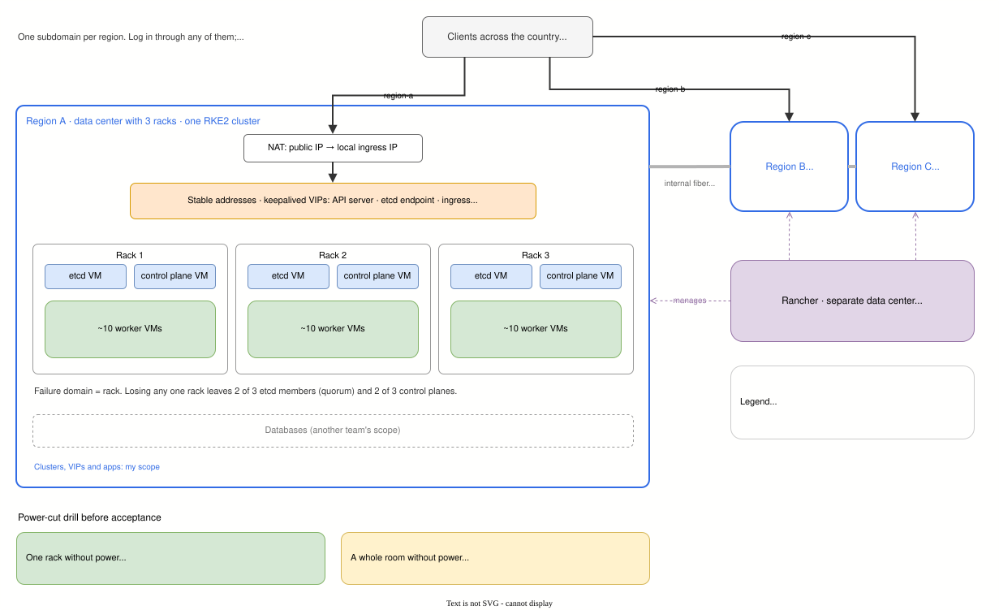

# Field note 01 · Highly Available On-Prem Kubernetes Across Three Regions

> **About field notes.** Unlike the labs in this repo, field notes describe real production work that cannot be reproduced publicly. The client, the application and every identifying detail are anonymized; numbers are approximate. They are written to show the decisions, the constraints and what actually happened, including what did not go to plan.

| | |
|---|---|
| **System** | Nationwide government field-operations platform, used by clients across the whole country |
| **My scope** | Design, build and operation of the Kubernetes clusters and the application platform on them. The databases were owned by another team and are out of scope here |
| **Period** | 2021 to 2025: about 3 months of research, 1 month to build, then operated until 2025 |
| **Starting point** | An existing system running on LXC containers, hard to maintain and with limited high availability |

## Constraints

- **Three regional data centers**, each in a different region of the country, each with **three racks**. The regions were linked by the client's own fiber network and treated as one large internal LAN. Latency between regions stayed under about 50 ms.
- **Bare metal, virtualized by the data center team.** I received VMs and treated each VM as a Kubernetes node. A rack could be partitioned into at least 12 VMs.
- **Onsite access only.** Remote access was only possible through a VPN that required installing tracking software on the engineer's laptop. My employer refused that, so every intervention, including standing by during data center maintenance, meant being physically on site. The platform had to heal itself, because nobody could log in from outside.
- **Shared vocabulary had to be built first.** To me a *node* was one Kubernetes host. To the data center team a *node* was a rack, which they partitioned into *datanodes*. Several early conversations went in circles until we agreed that "my node" meant "their datanode".

## Design

### Three independent clusters, one per region

| Decision | Why |
|---|---|
| **One cluster per region**, not one cluster stretched across all three | Operational: each region shows up as its own cluster in Rancher, easy to identify and manage. A side effect, not a design goal at the time: a failure or a bad change stays inside one region, and etcd never has to keep quorum across inter-region links |
| **The rack is the failure domain** | Each rack hosts one etcd member, one control plane and a share of the workers, so losing any single rack leaves 2 of 3 etcd members (quorum) and 2 of 3 control planes |
| **External etcd** (etcd on its own VMs, not stacked on the control planes) | Modular maintenance: etcd and the control plane can be patched, replaced or rebuilt independently |
| **Central management (Rancher) in a separate data center, not highly available** | The three regional data centers had no capacity allocated for it, so it was provisioned separately. It was deliberately a single instance: if it goes down, the clusters and applications keep running and only the unified control view is lost until it returns |

Per region: 3 racks × (1 etcd VM + 1 control plane VM + about 10 workers), roughly 36 VMs.

### Stable addresses that move behind the scenes

Clients and components always called the same IP, while the machine behind it could change.

- **keepalived** held virtual IPs for the **API servers**, for the **etcd endpoint used by the control planes**, and for the ingress entry point.
- **MetalLB** gave the ingress controller (ingress-nginx) a local load-balancer IP.
- Public traffic reached the cluster through **NAT**: the client's network translated the public IP to the local ingress IP. No public IP was attached to the cluster directly.
- **Assessed and not chosen: kube-vip.** It covers the same ground as keepalived and MetalLB together (a VIP for the API servers and IPs for load-balancer Services). In the mode I evaluated it relied on Layer 2 (ARP) announcements, which I wanted to avoid on a network I did not control, so I kept keepalived. kube-vip also offers a BGP mode, which I did not evaluate at the time.

The VIP in front of etcd was not the first design. Control planes were first configured with the three etcd member addresses directly, which is the usual setup. During an early failure the control planes did not come back, and the problem I traced at the time pointed at certificates. I do not have the records to state the root cause with certainty, so I will not claim more than that: putting a stable VIP in front of etcd made recovery predictable in that environment, at the cost of one more moving part.

### The part high availability did not cover: one entry point for the whole country

Inside a region, a client always reached a healthy machine. **Across regions there was no equivalent**, and this became the most debated decision of the project.

- **keepalived does not scale to regions.** VRRP moves an IP within one network segment; each region also had its own public IP, translated by its own NAT. There was no single address that could float to whichever region was healthy.
- **What the problem actually needs** is global load balancing (GSLB): one name for the whole country that sends each client to a suitable, healthy region. In the cloud this is a managed service such as Cloudflare's load balancer. **The client did not allow services of that kind**, and at the time I had no other option in mind.

> **Two legitimate priorities.** I lean towards pragmatic solutions: a managed global load balancer such as Cloudflare would have solved this in days, which is why I proposed it. The client, as a government body, weighs **sovereignty** first: no traffic, metadata or control of a national system routed through an external third-party provider. Neither view is wrong; they optimize for different risks. The design below is what fits inside the client's constraint.
- **What I proposed: one subdomain per region.** A user could log in through any region's subdomain; the login services of the three regions talked to each other in the backend. After login, the user was redirected to the subdomain of their **home region**, because each user's data lived only in their home region's database.
- **The dispute.** The client expected one address for everyone. Per-region subdomains were accepted as the compromise. I still consider a proper global load balancer the cleaner answer wherever policy allows one.

In hindsight, the redirect was not only a load-balancing workaround; it was the **data model showing through**. With user data held only in its home region, a user whose home region is completely down cannot work, whatever sits in front. The room-level power cut in the drill showed exactly that: users of the dark region could not log in, while the other regions carried on.

## Evolution while in operation: k3s to RKE2, without downtime

The first clusters ran **k3s**: quick to install and enough to start. In operation its feature set proved too thin for this platform; k3s is optimized for small and edge deployments. I moved every region to **RKE2**, managed by Rancher, without a maintenance window:

1. Drain and remove part of the k3s nodes; the remaining k3s nodes keep serving.
2. Reinstall the freed VMs as an RKE2 cluster.
3. Move workloads to RKE2 step by step.
4. When k3s is empty, reinstall its last nodes into RKE2.

High availability is what made this possible: at every step one of the two clusters had enough capacity to carry the traffic.

## Proof: a power-cut drill before acceptance

Before formal handover, the client required a drill that did not simulate failures; it caused them, by **cutting electrical power**.

| Drill | What happened |
|---|---|
| **Power cut to one rack** | Service continued. Mobile clients noticed nothing. Some web clients were suddenly logged out: the first diagnosis pointed at frontend cookies and session handling. It was judged acceptable and not investigated further |
| **Power cut to an entire room** | The region in that room went down entirely: cluster, applications and databases. Its users could not log in. The other two regions kept serving their users without interruption |

What the drill showed beyond "pass": inside a region, losing a rack is absorbed (apart from the web logouts); losing the room takes the whole region with it, and the damage stays in that region. Because each user's data lives only in their home region, users of the dark region have nowhere else to go until it returns.

## What I would do differently today

- **Re-evaluate the stack first.** Several components I used have since been retired or changed distribution: ingress-nginx is retired, and MinIO's community distribution has changed. Today the entry point would be a Gateway API implementation such as Envoy Gateway ([lab 02](../../02-progressive-delivery/)), and object storage would need a fresh choice ([lab 01](../../01-stateless-monolith/) uses RustFS).
- **Start on RKE2.** The k3s phase cost a migration that a slightly longer evaluation would have avoided.
- **Follow up the web logouts.** Web sessions that disappear when a rack goes down usually mean session state held where a single failure can lose it. Moving session state to a shared store is exactly the pattern in [lab 01](../../01-stateless-monolith/).
- **Revisit the etcd VIP.** etcd clients handle multiple endpoints natively; with better records of the original certificate problem, I would fix the root cause instead of adding a VIP.
