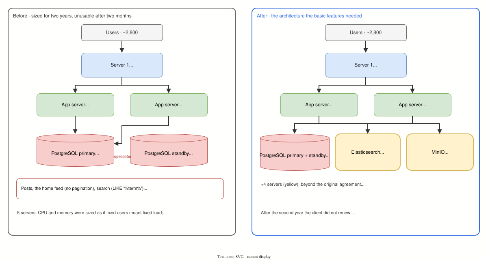

# Field note 02 · An Internal Social Network That Outgrew Its Estimate in Two Months

> **About field notes.** Unlike the labs in this repo, field notes describe real production work that cannot be reproduced publicly. The client, the product and every identifying detail are anonymized; numbers are approximate. This one is a postmortem: it is about what we got wrong.

| | |
|---|---|
| **System** | An internal social network for a large company: posts with media, a home feed, search |
| **Users** | About 2,800, expected to stay under 3,000 |
| **Load at the breaking point** | About 3,200 new posts per day |
| **My role** | DevOps: providing and operating the environments the application needed |
| **Outcome** | Infrastructure sized for two years became unusable after two months. Fixing it cost more than the original agreement covered, and after the second year the client did not renew |

## What we believed at the start

None of us (backend, DevOps, solution architect) had built a social network before. The one thing we knew was that a personalised "for you" feed needs machine learning. This product explicitly did not want one, so we concluded the rest would be easy: posts, a feed, a search box.

Three design decisions followed from that confidence:

1. **Search** was a SQL query with `LIKE '%term%'`.
2. **The home feed had no pagination.** We removed it on purpose, because we wanted infinite scroll like the big social apps.
3. **Media files were stored in PostgreSQL** as base64 text, next to the posts.

The database was sized at **4 vCPU / 8 GB RAM**, one primary and one standby managed by Patroni: highly available, and expected to last two years.

## How the estimate was made, and what it missed

The two-year projection came from a small test: measure how much disk the test data used, multiply by the expected number of days. Because the number of users was fixed (under 3,000), we assumed **CPU and memory needs were fixed too**, and only disk would grow.

That assumption was the root mistake. **The users stayed constant; the work per request did not.** With no pagination and an unindexed search, every feed load and every search touched more rows each day, so CPU, memory and I/O grew with the data, not with the users.

## What happened

- **At release**, everything worked as expected.
- **Within two months**, search started timing out. We raised the timeout step by step up to **5 minutes**, and stopped there: a search that takes minutes is already a broken feature from the user's point of view.
- **The home feed began to time out as well.** Without pagination, every load asked for the whole feed, media included.
- **Users escalated to the client's board of directors.** We had to add infrastructure beyond what the agreement covered, at our own loss, just to make the basic features work.

## Why each decision broke

| Decision | Why it worked at first | Why it failed with data |
|---|---|---|
| Search with `LIKE '%term%'` | Small tables are scanned in milliseconds | A pattern that starts with `%` cannot use an ordinary index, so every search reads every post, and that cost grows with every post ever written |
| No pagination, for "infinite scroll" | Small feeds load at once | **Infinite scroll is pagination**: the app loads the next page as the user scrolls. Without it, each visit fetched the entire feed, a payload that only ever grows |
| Media as base64 in PostgreSQL | One place for all data, nothing else to run | Base64 makes each file about a third larger, every feed query dragged the media bytes along, and the database carried what is really file storage |

Each decision alone might have survived longer. Together they multiplied: the feed had no limit, and what it returned was heavy.

## The fix

The architecture we should have started with:

- **Elasticsearch** for search.
- **Pagination** for the home feed (infinite scroll on top of it, as it should have been).
- **Object storage** for media, out of the database.

My part was providing and operating the environments for these, on top of the existing platform.

It worked, but too late for the relationship. After the second year the client declined to renew: the infrastructure had become **too expensive for what they saw as "just" an internal social network**. Their expectation of a cheap system came from us; we had promised it before we understood the product.

## Lessons

- **Search, analytics and large objects are not small features.** Their cost grows with the amount of data, not with the number of users. They need their own infrastructure (a search engine, object storage, analytical storage), and that cost has to be in the estimate from day one. Do not rely on plain SQL pattern matching over a large and growing dataset.
- **Constant users do not mean constant load.** An estimate must model how the cost of each request grows with the data, not only how fast the disk fills.
- **Never store files in the database.** Store them in object storage and keep a reference in the database.
- **Infinite scroll still needs pagination underneath.**
- **No estimate without incubation.** This project is why my CV ends with: *"Infrastructure estimates are approximate and assumption-based in the absence of product incubation. Exact requirements depend on finalized product scope, tech stack, and user targets."* I would not commit to infrastructure for a product like this again without assessing and incubating it first.
