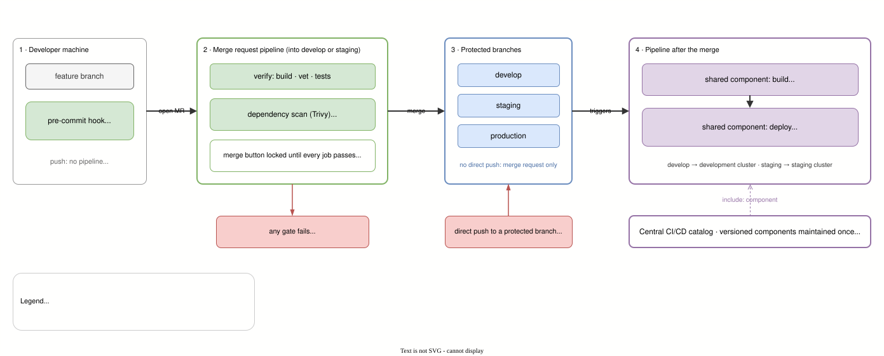

# Playbook 01 · Protected Branches, Merge-Request Gates and Shared Pipeline Components

> **About playbooks.** Playbooks describe how I set things up by default, distilled from pipelines I run in production. Examples are rewritten and generic: no organization, registry, runner, cluster or project names. The structure is real; the snippets are illustrations, not copies.

**Platform: GitLab CI/CD** (self-managed GitLab, `.gitlab-ci.yml`, components from a CI/CD catalog). All snippets below are `.gitlab-ci.yml`.

The goal is simple: **nothing reaches a shared environment except through a reviewed, verified merge request**, and every service gets the same pipeline without each team copying it.

## The flow



1. **Developer machine.** Work happens on a feature branch. Lint runs as a pre-commit hook; pushing the branch starts no pipeline.
2. **Merge request pipeline.** Opening a merge request into `develop` or `staging` runs the gates: build, vet and tests, then a dependency scan. The merge button stays locked until both pass.
3. **Protected branches.** `develop`, `staging` and production accept changes only through a merge request; a direct push is rejected.
4. **After the merge.** The pipeline on the protected branch builds and scans the image, then deploys it to that branch's environment, using shared components from a central catalog.

## 1. Protected branches: the only way in is a merge request

- Long-lived branches (`develop`, `staging` and production) are **protected**: nobody pushes to them directly.
- Work happens on feature branches and lands through a merge request.
- The project setting **"pipelines must succeed"** is on, so the merge button stays locked until every gate is green.

This is a repository setting, not YAML, and it is the part that makes everything below enforceable: gates in a pipeline mean nothing if someone can push around them.

## 2. Pipelines run only where they matter

```yaml
workflow:
  rules:
    - if: '$CI_COMMIT_BRANCH =~ /^(develop|staging)$/'   # after a merge
    - if: '$CI_PIPELINE_SOURCE == "merge_request_event"' # while reviewing
    - when: never                                         # anything else: no pipeline
```

Pushing to a feature branch costs no runner time. The pipeline starts when someone asks for a merge, and again when the merge lands.

## 3. Merge-request gates

**Linting happens before the commit, not in the pipeline.** Developers run the linter as a **pre-commit hook** on their own machines, so style and lint feedback arrives in seconds, before anything is pushed, and the pipeline does not spend runner time on it.

**Verify.** Build, vet and test: the checks that need a clean, reproducible environment.

```yaml
verify:
  rules:
    - if: '$CI_PIPELINE_SOURCE == "merge_request_event"'
  script:
    - go build ./...
    - go vet ./...
    - go test ./...
```

**Dependency scan.** Trivy scans the repository's dependencies; any HIGH or CRITICAL vulnerability fails the job, and because the job may not fail, the merge stays blocked.

```yaml
dependency-scan-mr:
  rules:
    - if: '$CI_PIPELINE_SOURCE == "merge_request_event"'
  image: {name: aquasec/trivy, entrypoint: [""]}
  script:
    - trivy fs --scanners vuln --severity HIGH,CRITICAL --exit-code 1 .
  allow_failure: false
```

The vulnerable dependency is caught while it is still one line in one merge request, not after it is built into an image and deployed.

## 4. After the merge: shared, versioned pipeline components

Services do not carry their own build and deploy logic. They include **versioned components from a central CI/CD catalog** and pass inputs:

```yaml
include:
  - component: <gitlab-host>/<platform-group>/backend-ci@<version>   # security scan + image build
    rules:
      - if: $CI_COMMIT_BRANCH == 'develop'
    inputs:
      image_name: "$IMAGE:$CI_COMMIT_BRANCH-$CI_COMMIT_SHORT_SHA"

  - component: <gitlab-host>/<platform-group>/k8s-deploy@<version>    # deploy to the develop cluster
    rules:
      - if: $CI_COMMIT_BRANCH == 'develop'
    inputs:
      image_name: "$IMAGE:$CI_COMMIT_BRANCH-$CI_COMMIT_SHORT_SHA"
      namespace: <namespace>
      env_file_variable: DEV_ENV     # the environment's config, kept as a CI/CD file variable
```

- **One fix, every service.** A change to the build or deploy logic is made once in the component and rolled out by bumping a version, not by editing every repository.
- **Pinned versions.** Each service chooses when to move to a new component version, so a component change cannot break all pipelines at once.
- **Each environment is its own include** with its own inputs: `develop` deploys to the development cluster, `staging` to a separate cluster. Reusing the same names for Kubernetes objects across clusters is fine, because namespaces are scoped per cluster.
- **Image tags are `<branch>-<short-sha>`**: every deployed image traces back to one commit.
- **Configuration lives outside the repository.** Each environment's settings are a CI/CD file variable, turned into a Kubernetes Secret at deploy time.

## A trap worth knowing: job names and included components

When a project defines a job with **the same name** as a job inside an included component, GitLab does not create a second job: it **merges the two definitions** silently. A local `trivy-scan` meant as an extra merge-request gate would quietly change the component's own `trivy-scan` job instead.

The rule I follow: **local jobs never reuse a name that an included component defines**. That is why the merge-request scan above has its own name.

## Small conveniences

- **Cache jobs are manual.** Warming up or clearing the dependency cache is a button on the merge request, used when the cache is stale, never a step every pipeline pays for.
